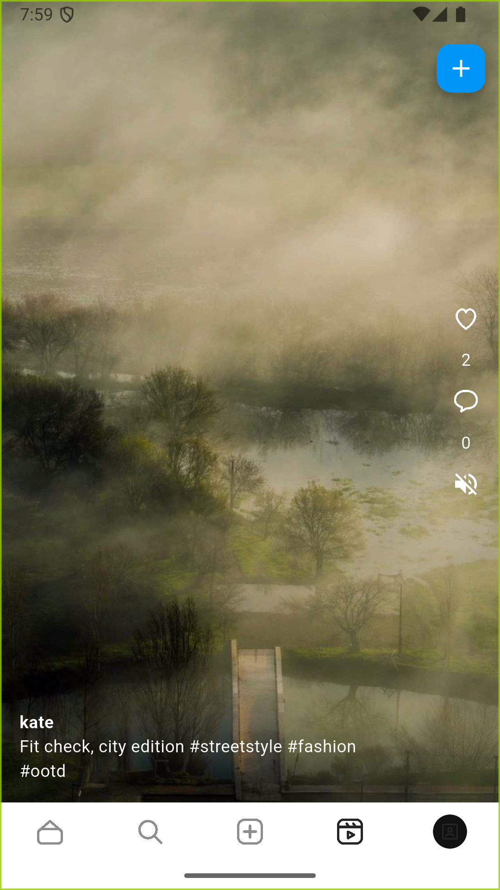
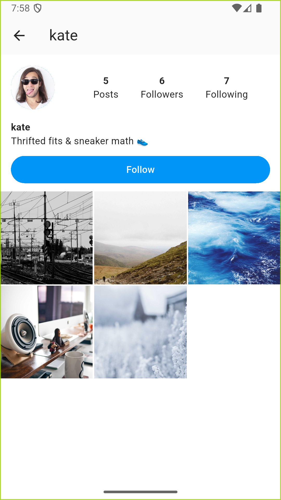
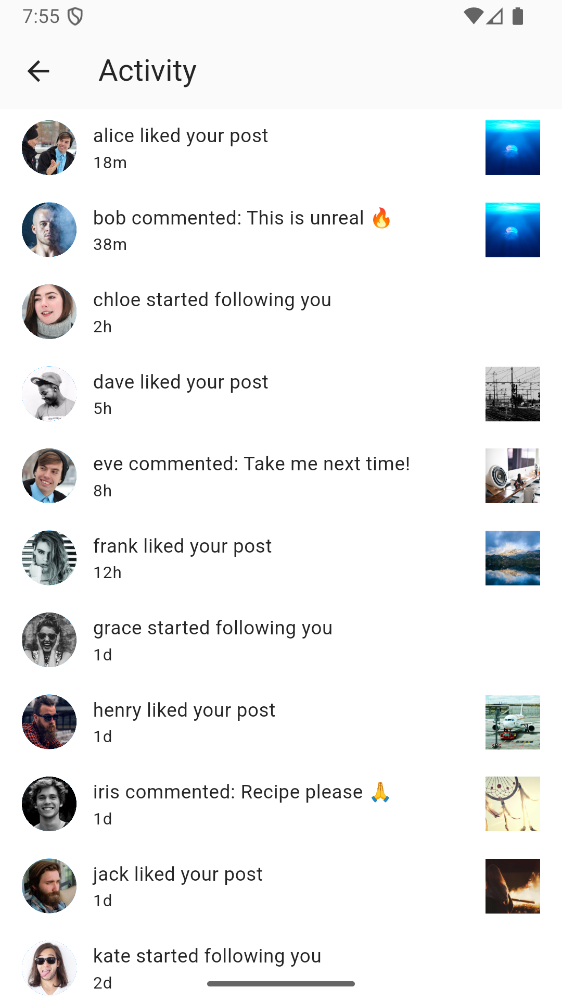
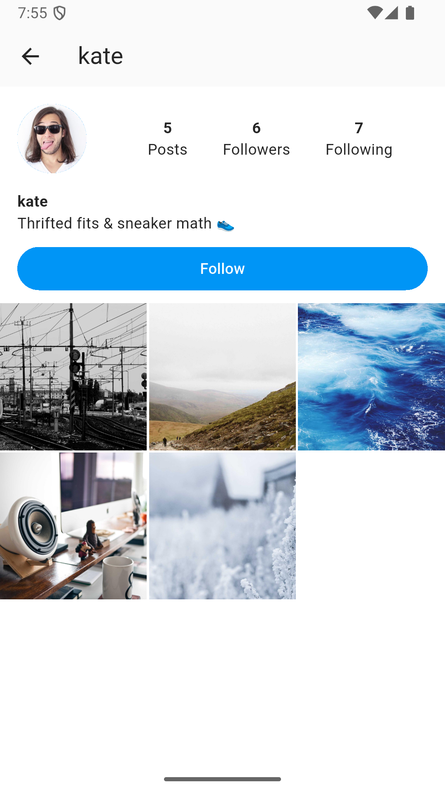
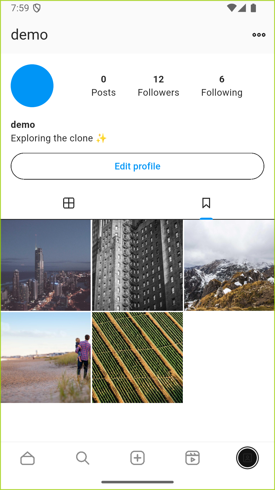
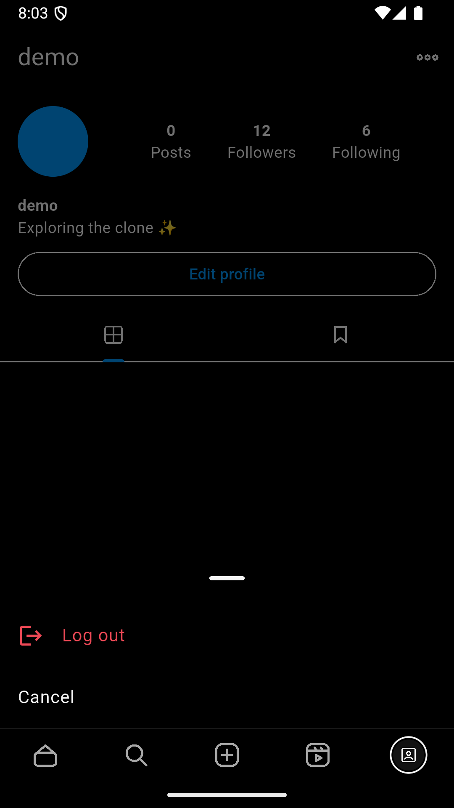
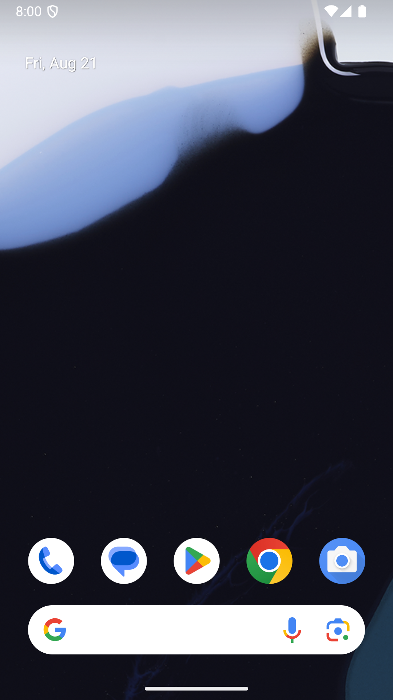
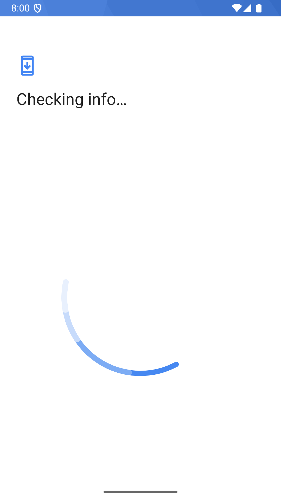

# An Instagram clone, written entirely by AI agents

[](https://github.com/YofarDev/flutter_instagram_clone/actions/workflows/ci.yml)
[](LICENSE)
[](https://dart.dev)
[](https://github.com/YofarDev/flutter_instagram_clone/actions/workflows/ci.yml)
[](https://github.com/YofarDev/flutter_instagram_clone/stargazers)

**A working Instagram clone where zero lines of Dart were written by a human.** Every feature, test, rule and commit came out of an AI agent session (opencode / Claude Code on GLM 5.3) — one feature slice at a time, with plans, tests and review passes along the way. It runs against a real Firebase backend: no mocks, no fake latency, actual Firestore snapshots driving actual UI.

Why? To find out how far "vibe coding" really gets you — and to leave behind receipts you can check, not claims you have to trust. See [The receipts](#the-receipts).

**8 features · 258 tests · 2 locales · 0 hand-written lines.**

## Demo

~35 seconds on the Android emulator over seeded demo data: carousel swipe, double-tap like, story viewer, reels, image DMs with Seen receipts, Saved tab.


## Screenshots

Android emulator, seeded demo data. Dark theme first — the app follows the system theme, light shots at the end.

| | | |
|---|---|---|
|  |  |  |
|  |  |  |
|  |  |  |
|  |  |  |
|  |  |  |

## What works

| Area | Details |
|------|---------|
| **Auth** | Email + password, Google Sign-In, password reset, an onboarding gate that routes through the router redirect, logout |
| **Feed** | Real-time following-filtered feed, optimistic likes with rollback, **double-tap to like with heart burst**, **multi-image carousels** (swipe + counter + dots, legacy single-image posts still read), comments, **save/bookmark**, infinite scroll, pull-to-refresh, skeleton loading |
| **Stories** | 24h expiry enforced in the query, IG gradient rings on unseen stories, segmented progress bars, tap-thirds navigation, create from gallery/camera |
| **Reels** | Vertical pager with muted looping autoplay, pause on app lifecycle, double-tap like, **comments + owner notifications**, full create flow |
| **Explore** | 3-column grid of posts from people you *don't* follow (IG's discovery semantics), infinite scroll, debounced user search, hashtag pages with accent-folding (#café → #cafe) |
| **Chat** | Real-time 1:1 DMs over Firestore snapshots, deterministic conversation ids (sorted-uid pair), **typing indicators**, **image messages** (upload + pinch-zoom viewer + "Photo" previews), **read receipts** (rule-restricted readAt stamps + Seen label), **suggested users** |
| **Notifications** | Real-time like/comment/follow, unread badge on the heart, mark-all-read on open |
| **Profile** | Edit avatar/username/bio (avatar downscaled + compressed on upload), follow graph, follower/following lists, Grid + **Saved** tabs, more-menu |
| **Cross-cutting** | English + French (follows device locale), matched dark/light themes, hand-drawn icon set (zero icon-font dependency), haptic vocabulary, shimmer skeletons everywhere |

## Running it

You need a Firebase project with **Authentication** (Email/Password + Google), **Firestore** and **Storage** enabled. Then:

```bash
flutter pub get
dart pub global activate flutterfire_cli
flutterfire configure        # generates lib/firebase_options.dart (git-ignored)
flutter run
```

Only want to run the tests? No Firebase needed — the suite runs against mocks:

```bash
cp scripts/firebase_options_stub.dart lib/firebase_options.dart
flutter test
```

The security rules are in `firestore.rules` and `firebase.storage.rules` at the repo root — deploy them with `firebase deploy --only firestore:rules,storage` rather than running in test mode forever. They're field-level strict: strangers can only touch count fields, media writes are owner-scoped per folder, read-receipt updates may only stamp `readAt` on messages sent to you, and notification creates must name the caller as actor.

## Demo data

The seeder fills the project with 12 users, 60 posts — including 3-image carousels — with real photos (picsum/pravatar, downloaded and cached in `scripts/seed/assets/`), stories, reels, comments, notifications and chat threads with image messages and read receipts, all wired to your own account so your feed isn't empty:

```bash
cd scripts/seed && npm install
# Firebase console → Project settings → Service accounts → Generate new private key
# save it as scripts/seed/serviceAccount.json (git-ignored)
node seed.js --me=<your-uid>       # add --reset to wipe and reseed
```

Your uid is in the Firebase console under Authentication. Re-runs are idempotent — every Firestore document id is deterministic, so nothing duplicates. (Storage uploads from re-runs are not yet garbage-collected; `--reset` wipes Firestore only.)

## How it's built

Feature-first clean architecture: each feature (`feed`, `stories`, `reels`, `chat`, …) owns its `data` / `domain` / `presentation` layers, and only `core/` is shared. Dependencies point inward — screens talk to cubits (`flutter_bloc`), cubits to repository interfaces, implementations live in data and are wired in a single `service_locator.dart`. Failures travel as `Either<Failure, T>` from `fpdart`, so error handling is a type, not a promise.

```mermaid
flowchart td
  subgraph feature["each feature — feed · stories · reels · chat · explore · notifications · profile · auth"]
    presentation["presentation — screens · widgets · cubits"]
    domain["domain — freezed models · repository interfaces"]
    data["data — Firebase datasources · repository impls"]
    presentation -->|depends on| domain
    data -->|implements| domain
  end
  presentation --> core["core/ — get_it DI · go_router shell · IG theme tokens · custom icons · l10n"]
  data --> firebase[(Firebase Auth · Firestore · Storage)]
```

A few decisions worth knowing about:

- **go_router with an indexed StatefulShellRoute** — five tabs, each branch keeps its own navigator stack, so pushing a profile from search doesn't blow away your feed scroll position.
- **The follow graph is client-side-filtered, page by page.** Firestore's `whereIn` caps at 10 items, so the feed pages posts server-side (`orderBy createdAt, limit 10`) and filters each page by your following set locally. Fine at demo scale; the comment in `feed_cubit.dart` marks where server-side filtering takes over. A fresh account follows nobody — the empty feed links to search so you can fix that.
- **Counts are denormalized** onto user and post docs and mutated in transactions, because counting subcollections on read doesn't scale and Firestore can't do it in a query anyway.
- **`ponytail:` is a convention, not a ponytail.** Every deliberate shortcut in the code is annotated inline with its rationale and its revisit condition ("extract on 4th consumer", "full ICU fold if other scripts matter"). There are 50 of them today — count them yourself:

```bash
grep -rn "ponytail:" lib | wc -l
```

## The receipts

The "written entirely by AI agents" claim is checkable, not vibes:

- **[docs/plans/](docs/plans)** — nine dated phase implementation plans (~3,000 lines), one per feature slice, each ending in a `chore: complete phase N` commit.
- **The commit history** — 60+ conventional commits in a repeating rhythm: plan → per-layer feature slices → `fix: final review` pass → phase complete.
- **[AGENTS.md](AGENTS.md) and [.claude/skills/](.claude/skills)** — the rules the agents operated under (freezed v3 gotchas, controller lifecycle bans, auto dart-fix hooks) and the five custom enforcement skills that kept the architecture honest.
- **CI** — `flutter analyze` + all 258 tests on every push: [](https://github.com/YofarDev/flutter_instagram_clone/actions/workflows/ci.yml)

## Scripts

The agent tooling is part of the exhibit — this is the machinery that kept AI code honest:

| Script | What it does |
|--------|--------------|
| `scripts/fgen.sh <name>` | Scaffolds a new feature (all three layers + tests) and runs codegen |
| `scripts/fstr.sh <key> <fr> <en>` | Adds a localization key to both ARB files |
| `scripts/fimp.sh` | Rewrites package imports to relative |
| `scripts/fdead.sh` | Finds orphaned files |
| `scripts/fanal.sh` | Architecture pre-analysis (feature map, DI wiring, cross-feature imports) |
| `scripts/fcheck.sh` / `fbuild.sh` | Analyze + test gate / build runner wrapper |
| `scripts/flutter_analyze_interceptor.py` | Hook: runs `dart fix` + format on every `.dart` edit |
| `scripts/screenshots.sh` | Walks the app and captures the screenshots above |

```bash
dart run build_runner build --delete-conflicting-outputs   # after model changes
flutter test                                               # 258 tests, ~10s
```

## Roadmap

Everything above works end-to-end, including carousels, image DMs and read receipts. Next up, in wow-per-effort order: unread badges on the DM list, story replies, share-post-to-DM, FCM push, group chats.

## Star history

[](https://star-history.com/#YofarDev/flutter_instagram_clone&Date)

## License

[MIT](LICENSE). Bundled fonts (Inter, Grand Hotel) are under their own SIL OFL 1.1 licenses, shipped next to the TTFs in `assets/fonts/`.
