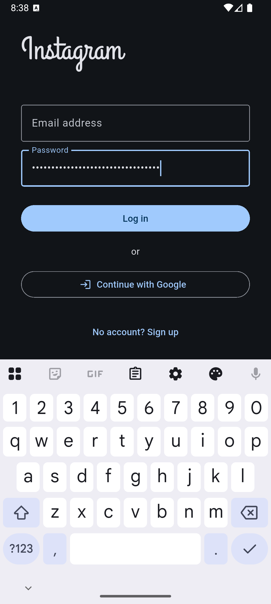
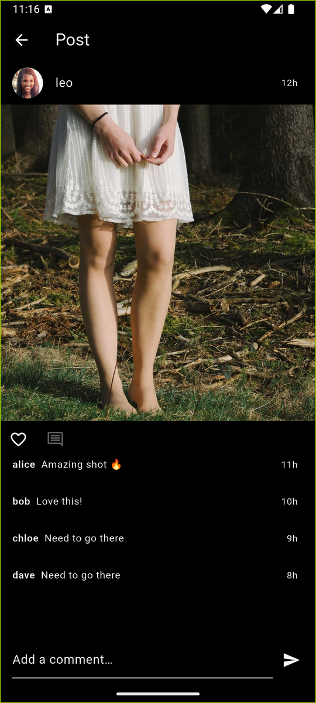
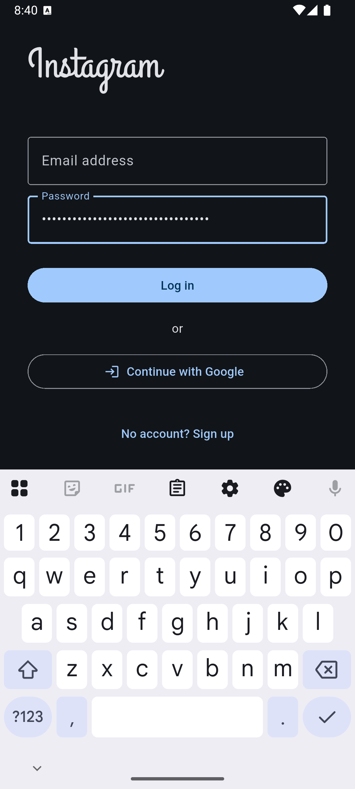
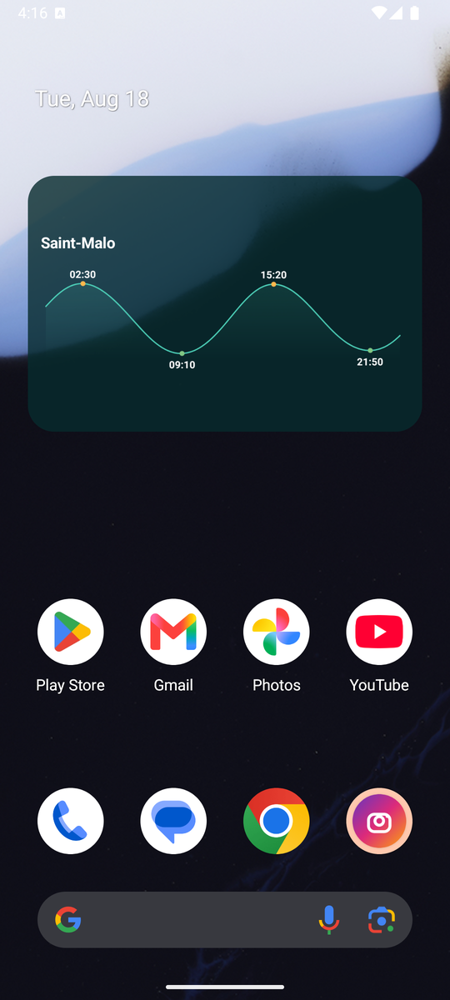
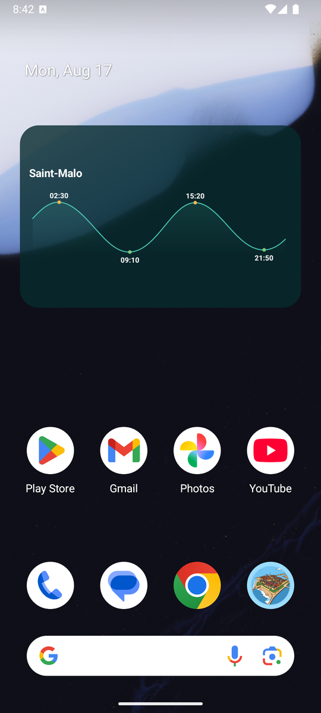
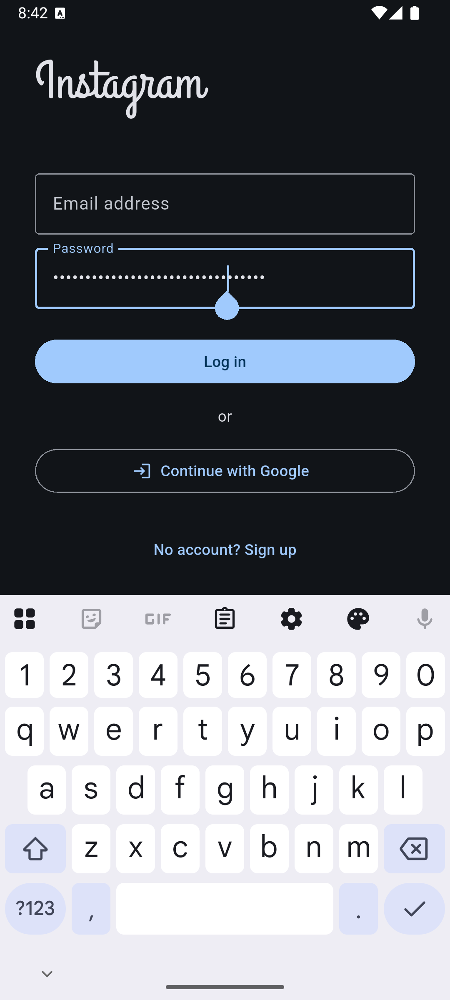

# Instagram clone — Flutter + Firebase

A working clone of Instagram, built to find out how far "vibe coding" gets you: every line was written by an AI agent (opencode / Claude Code on GLM 5.3), one feature at a time, with tests and reviews along the way. No hand-written Dart.

What's in it: auth (email + Google), a home feed with images and video reels, stories that expire after 24h, likes, comments, follow graph, search over users and hashtags, notifications, and real-time direct messages. It runs against a real Firebase backend — no mocks, no fake latency.

## Screenshots

From the Android emulator, running on seeded demo data (dark theme; the app follows the system theme and has a matching light one):

| | |
|---|---|
|  |  |
|  |  |
|  |  |
|  |  |
|  |  |

## Running it

You need a Firebase project with **Authentication** (Email/Password + Google), **Firestore** and **Storage** enabled. Then:

```bash
flutter pub get
dart pub global activate flutterfire_cli
flutterfire configure        # generates lib/firebase_options.dart (git-ignored)
flutter run
```

The security rules are in `firestore.rules` and `firebase.storage.rules` at the repo root — deploy them with `firebase deploy --only firestore:rules,storage` rather than running in test mode forever.

## Demo data

The seeder fills the project with 12 users, 60 posts with real photos (picsum/pravatar, downloaded and cached in `scripts/seed/assets/`), stories, reels, comments, notifications and chat threads, all wired to your own account so your feed isn't empty:

```bash
cd scripts/seed && npm install
# Firebase console → Project settings → Service accounts → Generate new private key
# save it as scripts/seed/serviceAccount.json (git-ignored)
node seed.js --me=<your-uid>       # add --reset to wipe and reseed
```

Your uid is in the Firebase console under Authentication. Re-runs are idempotent — every document id is deterministic, so nothing duplicates.

## How it's built

Feature-first clean architecture: each feature (`feed`, `stories`, `reels`, `chat`, …) owns its `data` / `domain` / `presentation` layers, and only `core/` is shared. Dependencies point inward — screens talk to cubits (`flutter_bloc`), cubits to repository interfaces, implementations live in data and are wired in a single `service_locator.dart`. Failures travel as `Either<Failure, T>` from `fpdart`, so error handling is a type, not a promise.

A few decisions worth knowing about:

- **go_router with an indexed StatefulShellRoute** — five tabs, each branch keeps its own navigator stack, so pushing a profile from search doesn't blow away your feed scroll position.
- **The follow graph is client-side-filtered.** Firestore's `whereIn` caps at 10 items, so the feed watches all posts and filters by your following set locally. Fine at demo scale; the comment in `feed_cubit.dart` marks where server-side filtering takes over.
- **Counts are denormalized** onto user and post docs and mutated in transactions, because counting subcollections on read doesn't scale and Firestore can't do it in a query anyway.
- **freezed + json_serializable** for models, **build_runner** codegen, l10n via ARB files (English and French).

## Scripts

| Script | What it does |
|--------|--------------|
| `scripts/fgen.sh <name>` | Scaffolds a new feature (all three layers + tests) and runs codegen |
| `scripts/fstr.sh <key> <fr> <en>` | Adds a localization key to both ARB files |
| `scripts/fimp.sh` | Rewrites package imports to relative |
| `scripts/fdead.sh` | Finds orphaned files |
| `scripts/screenshots.sh` | Walks the app and captures the screenshots above |

```bash
dart run build_runner build --delete-conflicting-outputs   # after model changes
flutter test                                               # 204 tests
```

## Status

All features listed above work end-to-end. The current branch is a visual-fidelity pass — Instagram-exact theming, custom-drawn icons, a real IG nav bar — with animation polish (double-tap-to-like, story rings, page transitions) still in progress.
